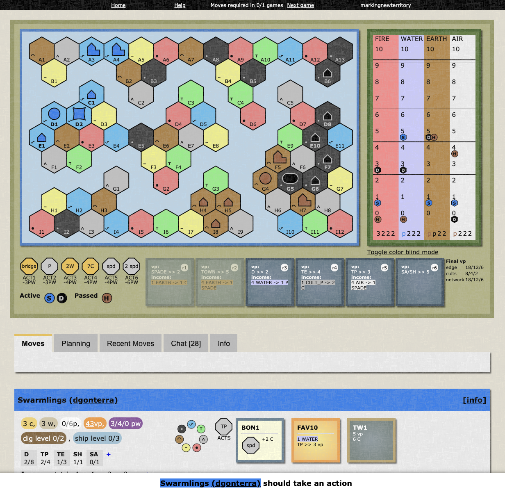

# Terra Mystica CSS

Custom CSS for [terra.snellman.net](https://terra.snellman.net/). To apply, use a browser extension that allows for custom CSS such as [User CSS for Chrome](https://chrome.google.com/webstore/detail/user-css/okpjlejfhacmgjkmknjhadmkdbcldfcb?hl=en). Simply paste in the contents of [terra-mystica.css](https://github.com/themarkappleby/terra-mystica/blob/master/terra-mystica.css).

